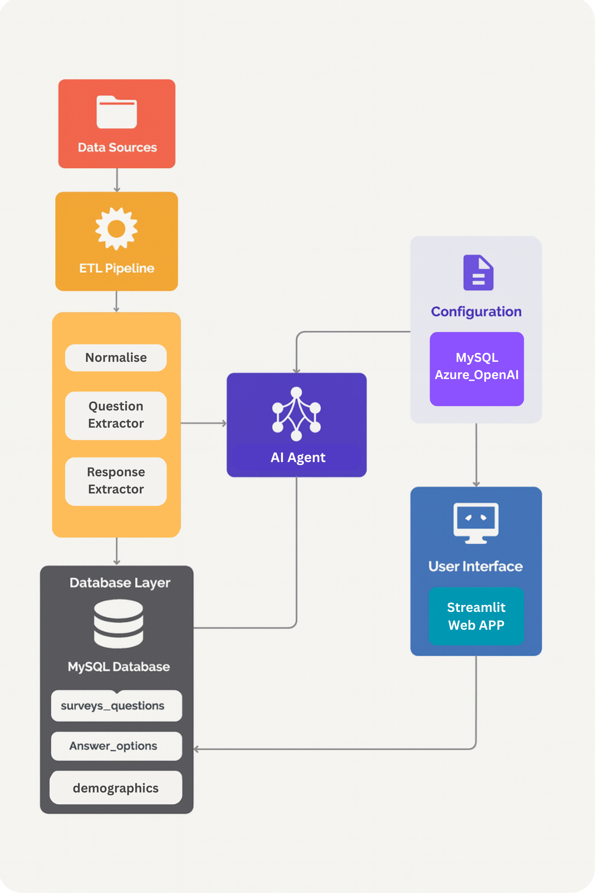

# AA Survey Analysis System - Technical Documentation

## 🏗️ System Architecture Overview

This system processes AA survey data from Excel files and provides intelligent AI-powered analysis through a natural language chatbot interface. The architecture follows clean separation of concerns with distinct ETL, database, and analysis layers.



### Core Components

- **ETL Pipeline**: Processes Excel survey data into structured database
- **MySQL Database**: Stores normalized survey data with demographic breakdowns
- **AI Chatbot**: Azure OpenAI GPT-4o powered natural language interface
- **Streamlit UI**: Web-based user interface for chatbot interaction

## 📊 Data Flow Architecture

```
Excel Files → Pre-Processing → ETL Processing → MySQL Database → AI Analysis → User Interface
```

### Key Design Principles

1. **Clean Architecture**: SQL handles data retrieval, AI handles intelligence and analysis
2. **Modular Processing**: Separate components for variant detection, question extraction, and answer processing
3. **Intelligent Analysis**: GPT-4o provides human-like analytical insights, not just data retrieval
4. **Conversation Memory**: Chatbot maintains context for follow-up questions

## 🔧 Technical Stack

- **Language**: Python 3.x
- **Database**: MySQL with custom survey schema
- **AI Platform**: Azure OpenAI Service (GPT-4o)
- **Data Processing**: Pandas for Excel manipulation
- **UI Framework**: Streamlit for web interface
- **Environment**: Virtual environment with pip dependencies

## 🎯 ETL Pipeline - Detailed Logic

### 1. Main Orchestrator (`runner.py`)

**Purpose**: Coordinates the entire ETL process from Excel files to database

**Key Functions**:

- `main()`: Entry point that processes year directories of Excel files
- `extract_survey_metadata()`: Extracts survey ID, month, year from filename
- File processing logic with duplicate detection

**Flow**:

1. Scans the folder containing excel files
2. Processes files matching pattern `AA_MMMyy.xlsx` or `AA_MMMyy_normalized.xlsx`
3. Skips already processed files using database flag
4. Calls preprocessing → P1 processing → marks as complete

### 2. Pre-Processor (`pre_processor/excel_utils.py`)

**Purpose**: Normalizes Excel files for consistent processing

**Key Functions**:

- `preprocess_excel()`: Creates normalized copy of Excel file
- `default_column_mapping()`: Maps demographic columns to database fields
- `_remove_empty_rows_columns()`: Cleans up Excel structure

**Logic**:

- Removes empty rows/columns that interfere with parsing
- Standardizes column headers for demographic mapping
- Creates `_normalized.xlsx` version for processing
- Handles `Unnamed: 0` columns (Excel index artifacts)

### 3. P1 Sheet Processor (`processor/p1_processor.py`)

**Purpose**: Main orchestrator for parsing the P1 (primary data) sheet

**Complex Logic Handled**:

#### Multi-Row Question Text Extraction

- Questions can span multiple Excel rows
- Stops at Base: lines, new Tables, or variant bullets (-)
- Combines rows with spaces to form complete question text
- Safety limit of 10 rows to prevent infinite loops

#### Table Block Processing

```python
# Pattern Recognition:
# Row N:   "Table 1"
# Row N+1: "Q1. How satisfied are you with..."
# Row N+2: "the government's handling of..."
# Row N+3: "Base: All respondents (1,234)"
# Row N+4: "Very satisfied    45    52    38..."
```

#### Variant Mode Detection

- Detects multi-part questions with "Summary" tables
- Handles both 2024+ format ("- Summary") and older formats
- Creates stem question (part 1) plus variants (part 2, 3, etc.)

### 4. Variant Detector (`processor/variant_detector.py`)

**Purpose**: Intelligent detection of multi-part questions

**Key Features**:

- `detect_variant_mode()`: Identifies if question has multiple variants
- `is_summary_table()`: Detects summary tables indicating variants exist
- `should_skip_summary_table()`: Prevents duplicate processing
- State tracking with `variant_mode_questions` and `part_counters`

**Complex Logic**:

```python
# Example Multi-Part Question:
# Q1. "How do you feel about speed cameras?"
# - When used to catch speeding motorists
# - When used in school zones
# - When used on motorways
```

### 5. Question Extractor (`processor/question_extractor.py`)

**Purpose**: Handles creation of question records in database

**Key Functions**:

- `extract_question_number_from_text()`: Regex parsing for Q1, Q2, QD1 patterns
- `create_stem_question()`: Creates main question (part 1)
- `create_variant_question()`: Creates question variants (part 2+)
- `extract_base_description()`: Finds "Base: All respondents..." text

**Pattern Recognition**:

- Handles Q1, Q2a, QD1 formats
- Distinguishes demographic questions (QD) from regular questions (Q)
- Extracts base descriptions for population context

### 6. Answer Processor (`processor/answer_processor.py`)

**Purpose**: Processes answer options and demographic data

**Complex Logic**:

#### Bullet Variant Processing

- Detects bullet points starting with "-"
- Creates new question variants for each bullet
- Manages option ordering across variants
- Skips "- Summary" bullets

#### Demographic Response Processing

- Maps Excel columns to demographic codes (age, gender, region, social grade)
- Processes response counts for each demographic breakdown
- Handles "Total" rows separately from demographic breakdowns

#### Pattern Examples:

```
Very satisfied      145   167   123   89   (demographic columns)
Fairly satisfied    234   198   156   134
Not satisfied       45    23    67    89
```

### 7. Database DAO (`database/dao.py`)

**Purpose**: All database interactions and data persistence

**Key Operations**:

- `insert_survey()`: Creates survey record with metadata
- `insert_question()`: Creates question with variants support
- `insert_answer_option()`: Creates answer choices
- `insert_p1_fact()`: Stores response counts with demographic breakdowns
- File processing tracking to prevent duplicates

## 🤖 AI Chatbot Architecture

### 1. Survey Chatbot (`azure_openai/survey_chatbot.py`)

**Purpose**: Intelligent natural language interface to survey data

**Architecture**: Multi-step AI reasoning pipeline

#### Step 1: Intent Analysis

- Analyzes user question to understand true intent
- Creates strategic data exploration plan
- Identifies relevant search terms and query types

#### Step 2: Data Exploration

- Executes multiple SQL queries based on plan
- Searches for relevant questions using flexible text matching
- Retrieves response counts and demographic breakdowns

#### Step 3: Insight Synthesis

- GPT-4o analyzes raw data to generate human-like insights
- Provides context, trends, and meaningful observations
- Includes proper citations with survey dates and question numbers

#### Key Features:

- **Conversation Memory**: Maintains context for follow-up questions
- **Multi-Part Question Detection**: Always checks for question variants first
- **Demographic Analysis**: Automatic breakdowns by age, gender, region, social grade
- **Accurate Counting**: Uses `MAX(p.cnt)` instead of `SUM(p.cnt)` to prevent inflation
- **Context Preservation**: Carries survey-specific context in follow-ups

### 2. Prompt Engineering (`azure_openai/prompts.txt`)

**Purpose**: External prompt management for non-technical deployment

**Structure**:

- Intent Analysis prompts (system + user)
- Data synthesis prompts (system + user)
- Critical rules for accurate counting
- Multi-part question detection instructions
- Demographic analysis guidelines

**Key Rules Implemented**:

- Always check for question variants before providing answers
- Use `item_label = 'Total'` for accurate response counts
- Maintain survey context in follow-up questions
- Provide citations in format: `(YYYY-MM Q[number].[part], count)`

### 3. Azure Configuration (`azure_openai/azure_ai_config.py`)

**Purpose**: Secure Azure OpenAI service configuration

**Features**:

- Environment variable loading with `python-dotenv`
- API key validation
- Default values for API version and deployment name
- Error handling for missing credentials

## 🗄️ Database Schema Design

### Core Tables Relationships

```sql
surveys (1) → (∞) survey_questions (1) → (∞) answer_options
                     ↓
                (∞) p1_responses (∞) ← (1) demographics
```

### Key Tables:

#### `surveys`

- **Purpose**: Tracks survey metadata and processing status
- **Key Fields**: `survey_id` (AA-012024), `year`, `month`, `filename`, `processed`

#### `survey_questions`

- **Purpose**: Stores all questions including variants
- **Key Fields**: `question_number` (Q1), `question_part` (1,2,3...), `question_text`
- **Supports**: Multi-part questions with part numbering

#### `answer_options`

- **Purpose**: All possible answer choices for questions
- **Key Fields**: `option_text`, `option_order`

#### `p1_responses`

- **Purpose**: Fact table storing all response counts
- **Key Fields**: `cnt` (response count), `item_label` (Total/demographic), `demo_id`
- **Critical**: `item_label = 'Total'` contains true totals (not inflated by demographics)

#### `demographics`

- **Purpose**: Dimension table for demographic categories
- **Categories**: Age (QD1), Gender (QD2), Region (QD3), Social Grade (QD4)

### Data Integrity Features:

- Foreign key constraints maintain referential integrity
- `INSERT IGNORE` prevents duplicate survey processing
- `ON DUPLICATE KEY UPDATE` for upsert operations
- Processed flag prevents reprocessing same Excel files

### 4. Running the System

#### ETL Script:

```bash
# Run the script to scrape files and load to DB
python runner.py
```

#### Chatbot UI:

```bash
# Start Streamlit interface
streamlit run streamlit_app.py
```

## 🔍 Key Processing Patterns

### Excel File Patterns Recognized:

- `AA_Jan24.xlsx` → Survey ID: `AA-012024`
- `AA_Dec23.xlsx` → Survey ID: `AA-122023`
- Files ending with `_normalized.xlsx` are skipped (generated files)

### Question Pattern Recognition:

- **Simple Questions**: `Q1. How satisfied...` → Single question record
- **Multi-part Questions**: `Q1. How do you feel about...` + `- Option A` + `- Option B` → Stem + variants
- **Demographics**: `QD1. Age` → Demographic question type

### Response Data Pattern:

```
Question Text        Total  Male  Female  18-24  25-34  Scotland  London  AB  C1
Very satisfied       1,234   567    667    234    345      123     456   234  345
Fairly satisfied       856   345    511    156    234       89     234   123  234
```

## 🐛 Common Issues & Solutions

#### Issue: Files not processing

**Solution**:

- Check filename follows `AA_MMMyy.xlsx` pattern
- Ensure files are in year directories (`excel_files/2024/`)
- Verify `processed` flag isn't already set in database

### Chatbot Issues:

#### Issue: Inflated response counts

**Root Cause**: AI was using `SUM(p.cnt)` across demographics
**Solution**: Use `MAX(p.cnt)` and filter by `item_label = 'Total'`

#### Issue: Inconsistent search results

**Root Cause**: Singular/plural keyword variations
**Solution**: Use `LIKE '%keyword%' OR LIKE '%keywords%'` patterns

#### Issue: Context lost in follow-ups

**Root Cause**: AI not carrying survey_id from previous queries
**Solution**: Enhanced system message to preserve survey context

## 🎯 Advanced Features

### Intelligent Question Variant Detection

The system automatically detects when questions have multiple parts and presents them to users:

```
User: "Tell me about Q1"
Bot: "Q1 is a multi-part question about speed cameras with 3 variants:
     - When used to catch speeding motorists
     - When used in school zones
     - When used on motorways
     Which variant would you like to analyze?"
```

### Demographic Analysis

Automatic demographic breakdowns with statistical insights:

```
User: "How do different regions feel about speed cameras?"
Bot: "Analysis shows regional variation in speed camera attitudes:
     • London: 67% support (845 respondents)
     • Scotland: 45% support (234 respondents)
     • Wales: 52% support (156 respondents)

     Strong urban/rural divide evident in the data."
```

### Conversation Memory

Maintains context across multiple questions:

```
User: "Tell me about the December 2022 seatbelt survey"
Bot: [Provides overview]
User: "What about Q4 and Q5?"
Bot: [Analyzes Q4/Q5 specifically from that survey, not all 2022 surveys]
```

## 📊 Data Quality Features

### Duplicate Prevention

- Survey processing tracked with `processed` flag
- `INSERT IGNORE` prevents duplicate survey records
- File-level tracking prevents reprocessing

### Data Validation

- Question number extraction with regex validation
- Demographic code mapping with fallback handling
- Numeric data validation before database insertion

### Error Handling

- Comprehensive logging throughout ETL process
- Transaction rollback on processing errors
- Graceful handling of malformed Excel data

## 🔄 Future Development Guide

### Adding New Demographic Categories

1. Update `_infer_demo_code()` in `answer_processor.py`
2. Add mapping in `default_column_mapping()` in `excel_utils.py`
3. Update database with new demographic records

### Extending Question Types

1. Modify regex patterns in `question_extractor.py`
2. Update `extract_question_number_from_text()` for new formats
3. Test with sample data in development environment

### Enhancing AI Analysis

1. Update prompts in `prompts.txt` for new analysis types
2. Add new query types in chatbot's exploration plan
3. Test with conversation scenarios to validate improvements

## 🤝 Handover Checklist

### For New Developers:

- [ ] Understand the ETL flow: Excel → Preprocessing → P1 Processing → Database
- [ ] Know the processor components: Variant Detector, Question Extractor, Answer Processor
- [ ] Understand multi-part question handling and variant creation
- [ ] Familiarize with database schema and relationships
- [ ] Test chatbot with various question types and follow-ups
- [ ] Understand prompt engineering in `prompts.txt`
- [ ] Know environment variable configuration
- [ ] Review common issues and solutions above
